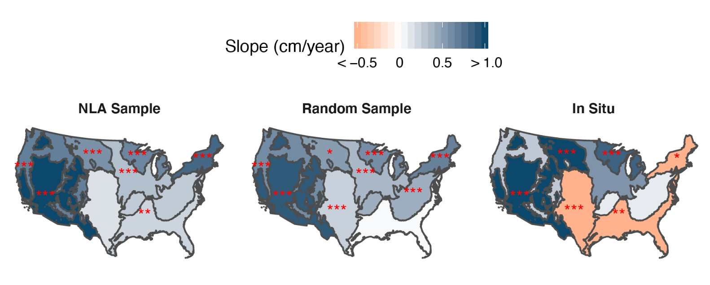

#  Motivation and Roadmap 

*The point is that if we are going to design ecosystems (and we continually do so whether we care to face all of the implications or not) then it will be best to design them intentionally, making use of all the ecological understanding we can bring to bear…*

– Jon Tillman Lyle, 1985


## Acknowledgments


## Acknowledgments


## Roadmap

- Mountaintop Mining (local, sensors)
   - Deeper, flatter
   - Slower, saltier
   - Not recovery, novelty

- Remote sensing, democratizing data (global, open)
   - Dissonance to harmony 
   - Science along (not in) rivers
   - Small, clearer lakes

- Putting all this data to work (macroscale, infrastructure)
   - Beyond bespoke watershed ecosystem studies
   - What do water suppliers need to know about their watershed? 
   - Using big environmental data for environmental justice

  
# Mountaintop Mining

<iframe width="900" height="500" src="https://www.youtube.com/embed/p5RcbPZXUZo" frameborder="0" allow="accelerometer; autoplay; clipboard-write; encrypted-media; gyroscope; picture-in-picture" allowfullscreen></iframe>

## Deeper, flatter

How does mountaintop mining physically alter the landscape?


## 

<iframe src="https://drive.google.com/file/d/1r9Gr5lVYWV88ySocI800ywg667pdf8Au/preview" width="100%" height="750"></iframe>

##

<iframe src="https://skytruthmtr.appspot.com/#" width="100%" height="750px"></iframe>


##

<iframe src="https://drive.google.com/file/d/1rl8xrKi4f_SthDyoAef2MyJdJtnvfj2r/preview" width="100%" height="750"></iframe>


## 

<iframe src="https://cuahsi.shinyapps.io/mtm_explore/" width="100%" height="750px"></iframe>


## Deeper, flatter

How does mountaintop mining physically alter the landscape?

## Deeper, flatter

Mountaintop mining deposited 6.4 km3 of spoil into headwater valley fills, lowering mined landscape slopes by 10º. 


## Slower, saltier


How do these physical changes lead to changes in downstream hydrology and biogeochemistry?

##

[Mining elevates baseflow](https://cuahsi.shinyapps.io/mtm_baseflow/)

## 

[Mining elevates weathering](https://cuahsi.shinyapps.io/mtm_weathering/)

##


## Slower, saltier

How do these physical changes lead to changes in downstream hydrology and biogeochemistry?


## Slower, saltier

Water stored in valley fills reacts with pyrite & generates a 45-fold increase in dissolved ion flux and a net geologic C release in mined watersheds.


## Not recovery, novelty

How long will these impacts last?  

*SMCRA*

## 


## 


##


##


##


##


##


##


##

 - Savannah vegetation (> 35 years)
 - Baseflow dominance (> 25 years)
 - Elevated weathering (> 30 years)
 - Geomorphic changes (> 10,000 years)

## Not recovery, novelty

Mined landscapes and the streams that drain them are novel ecosystems,
unlikely to return to their previous conditions over human timescales.

## Mountaintop mining


# Remote sensing, democratizing data


##


## 

```{r, echo=F}
knitr::include_graphics('images/florida_color.png')
```


## 


## Dissonance to harmony


## 

<iframe width="100%" height="750" src="https://www.youtube.com/embed/6LZURaRH3Ws" frameborder="0" allow="accelerometer; autoplay; encrypted-media; gyroscope; picture-in-picture" allowfullscreen></iframe>


## Science along (not in) rivers

##

<iframe src="https://drive.google.com/file/d/1N8Vm3IcG1yNpcfg1WywxzPQh3kjmG_UU/preview" width="100%" height="750"></iframe>


## How are America's rivers changing color? 

[Lead by John Gardner](https://cuahsi.shinyapps.io/RiverColor/)


## What are the dominant controls of sediment in the Colorado River? 
  
*Work with Matt Cohen and Jim Jawitz*

##


##


## 

<embed src="images/tss.zoom.html" style="width:1100px; height: 700px;">


## 


##


## How have macrophytes come to dominate the Loire river? 


*Work with Gilles Pinay, Florentina Moatar, Jake Diamond, Matt Cohen, John Gardner*

## 


##


##

<iframe src="https://drive.google.com/file/d/1WGulcwuskzIibl9D7E2gVa6tB09Y2cXH/preview" width="100%" height="700"></iframe>


## Smaller, clearer lakes

*Lead by Simon Topp, UNC Chapel Hill*

##


##


##


##



##

[Tutorials](images/LimnoSat_US_Tutorial.html)

# Putting all this data to work 

## Beyond bespoke watershed ecosystem studies

<iframe src="images/network_map.html" width="100%" height="750px"></iframe>


## 

[Macrosheds](https://cuahsi.shinyapps.io/macrosheds/)


## What do water suppliers need to know about their watershed? 

##

<iframe src="images/site_map.html" width="100%" height="750px"></iframe>


##

<iframe src="https://drive.google.com/file/d/1L-lxfHBS_ueZcsApO1IJcJfonAQXv1AF/preview" width="100%" height="750"></iframe>

## Using big environmental data for environmental justice


# Conclusions

## Original motivation

*The point is that if we are going to design ecosystems (and we continually do so whether we care to face all of the implications or not) then it will be best to design them intentionally, making use of all the ecological understanding we can bring to bear…*

– Jon Tillman Lyle, 1985

## Current motivation

- Open science: one term, five purposes [Fecher and Friesike 2014](https://link.springer.com/chapter/10.1007/978-3-319-00026-8_2)

##


